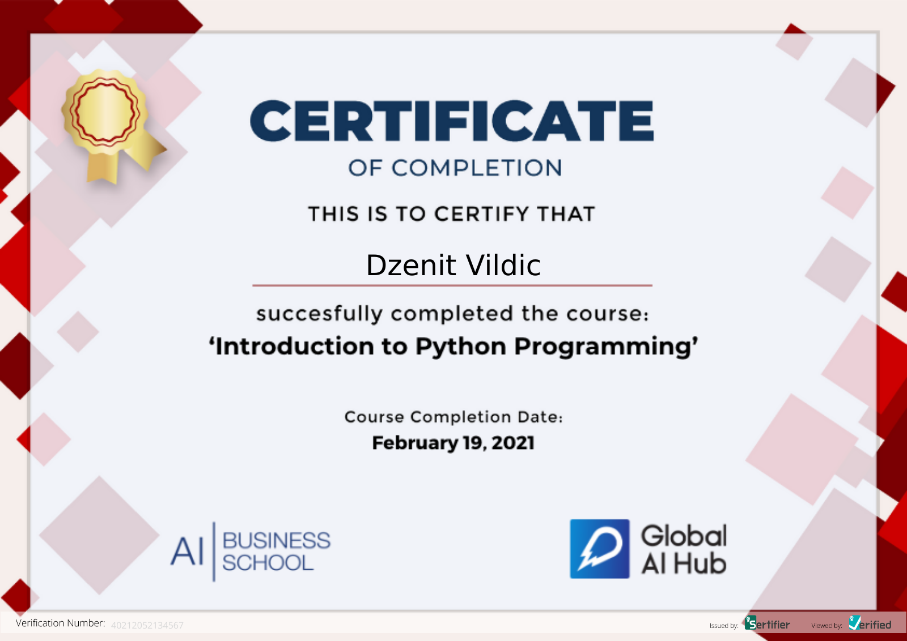

# GlobalAIHubPythonCourse


**Course Date:** 15.02.2021  
**Name:** Dzenit  
**Surname:** Vildic  
**Email:** dzenit6@gmail.com  


## Recipe Application
   Enter 3 recipes. Create a separate class for each recipe.
   Identify the products used in this recipe using init () method.
   Write a function about how long these products holud be used later.
   
   
## Libraries
```
NumPy library 
Pandas library 

```
---

### Certification


